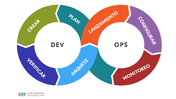

## Filosofía DevOps

La **filosofía DevOps** se centra en romper las barreras tradicionales entre los equipos de desarrollo (Dev) y operaciones (Ops), promoviendo una **cultura de colaboración, automatización y mejora continua**. Es una evolución cultural y organizativa que cambia la manera en que las empresas construyen, prueban, entregan y mantienen el software. 

### 1. **Colaboración y comunicación**
Uno de los pilares de DevOps es derribar los **silos** organizativos que suelen separar a los desarrolladores y los equipos de operaciones. En lugar de trabajar en áreas aisladas, ambos equipos colaboran desde el inicio hasta el final del ciclo de vida del software. Esta sinergia mejora la eficiencia y reduce los malentendidos o retrasos. 

### 2. **Responsabilidad compartida**
DevOps fomenta una **cultura de responsabilidad conjunta**, donde los equipos de desarrollo no solo son responsables de escribir el código, sino también de garantizar que funcione correctamente en producción. Esto significa que los desarrolladores deben tener una mayor comprensión de cómo el software se ejecuta en entornos reales y de cómo resolver problemas que puedan surgir.

### 3. **Automatización de procesos**
La automatización es esencial en DevOps para facilitar el flujo continuo de desarrollo y despliegue. Herramientas como Jenkins, Docker, y Ansible permiten la **integración continua** (CI) y la **entrega continua** (CD), automatizando tareas repetitivas como la construcción del código, las pruebas y los despliegues. Esto acelera el tiempo de entrega y reduce los errores manuales.

### 4. **Ciclos de retroalimentación rápidos**
En la filosofía DevOps, los ciclos de retroalimentación son cortos y continuos. Los equipos reciben información rápida sobre los cambios en el software, ya sea a través de pruebas automatizadas o de monitoreo en producción. Esto permite una mejora constante y un enfoque proactivo para la resolución de problemas.

### 5. **Cultura de aprendizaje continuo**
DevOps adopta una mentalidad de mejora constante y **aprendizaje continuo**. Esto se refleja no solo en la adopción de nuevas tecnologías y herramientas, sino también en el uso de datos de producción y métricas de rendimiento para ajustar y optimizar tanto el software como los procesos. La idea es que siempre hay algo que mejorar o aprender para hacer que el flujo de trabajo sea más eficiente.

### 6. **Enfoque en el cliente**
La filosofía DevOps pone al usuario final en el centro de todo el proceso. Al acortar los ciclos de desarrollo y entrega, las empresas pueden entregar actualizaciones y nuevas características rápidamente, respondiendo a las necesidades del cliente en tiempo real. Esto fomenta una mayor satisfacción del cliente y una adaptación más ágil a los cambios del mercado.

### 7. **Escalabilidad y flexibilidad**
Otro aspecto clave es la capacidad de **escalar de forma flexible**. Las soluciones DevOps están diseñadas para ser escalables y adaptarse a diferentes volúmenes de trabajo. La infraestructura como código (IaC), por ejemplo, permite gestionar y desplegar entornos de forma repetible y escalable, ajustándose a las necesidades cambiantes de la empresa.

### 8. **Resiliencia y calidad**
Con un enfoque en la **monitorización constante** y las pruebas continuas, DevOps busca construir sistemas resilientes que puedan manejar fallos o errores sin grandes interrupciones. El despliegue frecuente de pequeñas actualizaciones reduce el riesgo asociado a los grandes lanzamientos, facilitando la identificación temprana de problemas y permitiendo revertir cambios rápidamente si algo falla.

 

> **En resumen, la filosofía DevOps no solo aboga por la tecnología y la automatización, sino también por un cambio cultural dentro de las organizaciones. Fomenta la colaboración, el aprendizaje y la responsabilidad compartida para mejorar el flujo de trabajo y la entrega de software, con un enfoque en la calidad y la satisfacción del cliente.**
