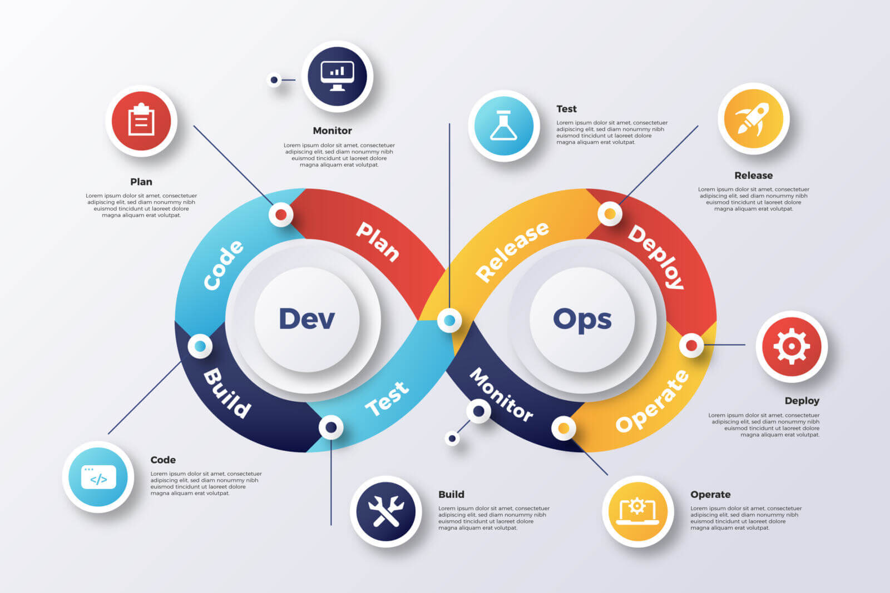

## Herramientas DevpOs
 

> Las herramientas DevOps son fundamentales para automatizar, gestionar y agilizar las diversas fases del ciclo de vida de desarrollo de software. Estas herramientas permiten una integración continua (CI), entrega continua (CD), gestión de infraestructura, monitoreo y colaboración entre los equipos de desarrollo y operaciones.

### 1. Jenkins
Función: Jenkins es una herramienta de integración continua y entrega continua (CI/CD). Automatiza la construcción, prueba e implementación del código, facilitando la integración rápida de los cambios.
Uso: Puedes configurarlo para ejecutar automáticamente las pruebas de un nuevo código que se suba al repositorio y, si las pruebas pasan, desplegar el código en un entorno de producción.
### 2. Docker
Función: Docker es una herramienta de contenedorización que permite a los desarrolladores crear, implementar y ejecutar aplicaciones en contenedores, que son entornos aislados y ligeros.
Uso: Docker garantiza que una aplicación se ejecute de la misma manera en cualquier entorno (desarrollo, pruebas o producción), eliminando problemas de configuración entre entornos.
### 3. Kubernetes
Función: Kubernetes es una plataforma de orquestación de contenedores que gestiona el despliegue, la escalabilidad y las operaciones de los contenedores Docker en clusters.
Uso: Facilita la gestión automática del escalado de aplicaciones y la recuperación en caso de fallos, asegurando alta disponibilidad y eficiencia en la infraestructura.
Estas herramientas forman parte del ecosistema de DevOps, donde se busca optimizar el flujo de trabajo y acelerar la entrega de software con calidad garantizada.
