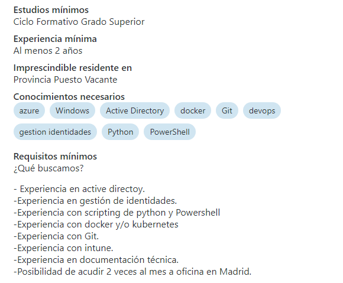
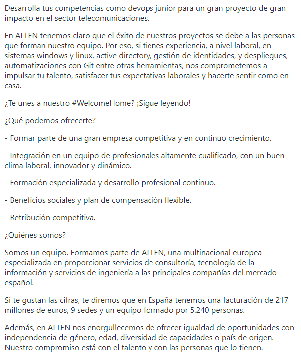

## Oferta de empleo
 Al entrar en [Infojobs.net](https://www.infojobs.net/) y poner en el buscador ***DevOps***, he escogido una oferta que seaplica para mi ya que es para ***juniors***

### Requisitos

### Descripción

### Motivos 

**Crecimiento profesional:** Como DevOps Junior, puedo aprender de profesionales con más experiencia y desarrollar habilidades clave en automatización, contenedores y orquestación (Docker, Kubernetes), integración continua (Jenkins) y otras herramientas del ecosistema DevOps.

**Alta demanda:** DevOps es una de las áreas más demandadas actualmente en tecnología, lo que significa buenas oportunidades de empleo y crecimiento a largo plazo.

**Diversificación de habilidades:** Trabajar con diferentes equipos (desarrollo, operaciones) y herramientas, lo que me permitirá desarrollar una visión integral del ciclo de vida del software.
